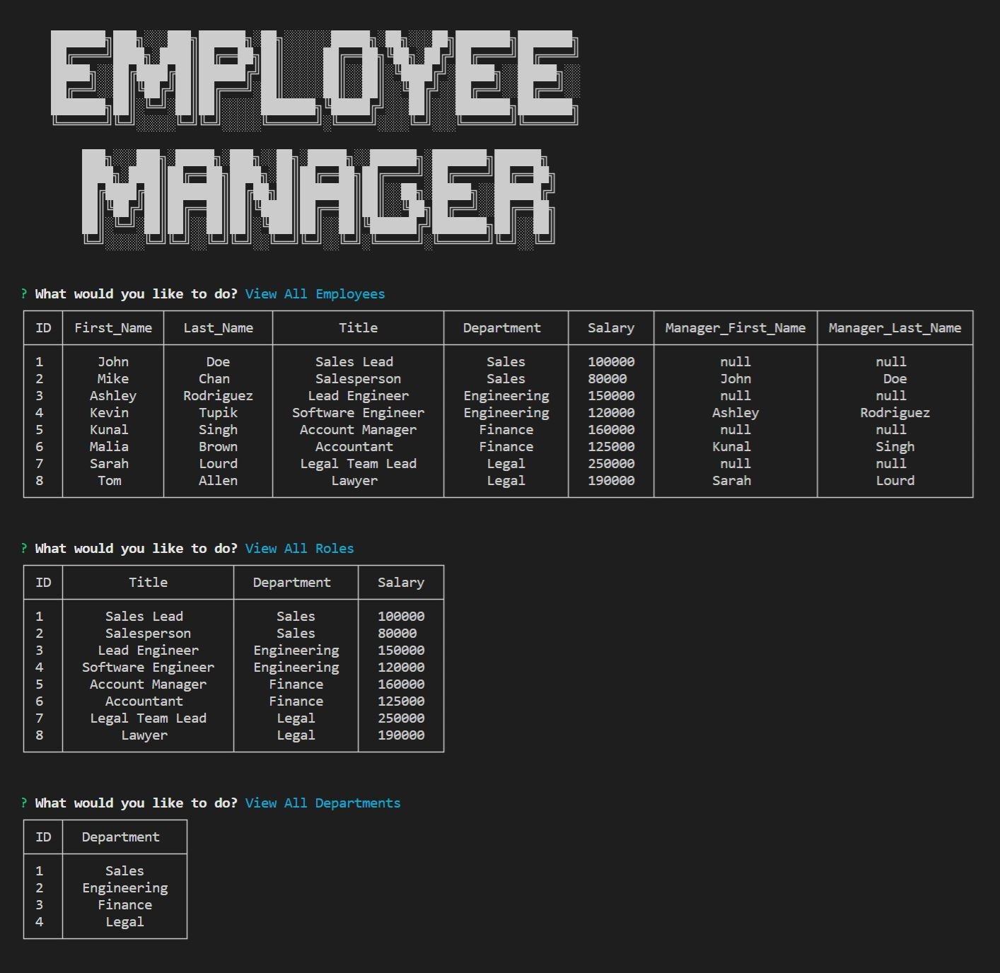

# theExcellentEmployeeTracker

## Table of Contents

- [Description](#description)
- [Installation](#installation)
- [Usage](#usage)
- [Questions](#questions)
- [License](#license)
- [Video](#walkthrough)
- [Screenshot](#screenshot)

## Description

This application will take user input to create departments, roles, and employees. There are many ways to manipulate the data such as seeing the total budget of a department, deleting and adding roles, managers, departments or viewing a managers team.

## Installation

You can clone the repository from this command:

```bash
git clone https://github.com/Zzaclipse/theExcellentEmployeeTracker.git
```

## Usage

Before you can use the program, make sure to create the database and put seeds in to the tables, to do so use the following command:

```bash
mysql -u <Enter your username> -p
```

You will then be prompted for your password, after which you will be logged in to mysql, to create the database and tables use the following command:

```bash
source schema.sql;
```

Now the database has been created, you can use the application if you add some data in to the tables. If you want some initial entries then use the following command to put some data in the tables:

```bash
source seeds.sql;
```

The application will be invoked in the command line by using the following command:

```bash
node index.js
```

Once the application is started it will ask questions to which you will select the answers and press enter.

## Questions

What is the developers github?

[Zzaclipse](https://github.com/Zzaclipse)

Where can I reach the developer to ask additional questions?

za.stokes@gmail.com

## License

This application is licened under ISC License

[](https://opensource.org/licenses/ISC)

## Walkthrough

[Video Link](https://drive.google.com/file/d/1fzTtcWUavrwcRJ-ip1fA19qeLSJ_cOjC/view)

## Screenshot


